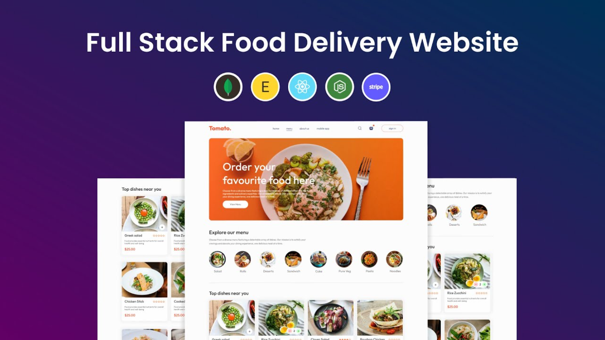

# Tomato Website

Tomato Website is a comprehensive 10+ page food ordering platform built using the MERN stack (MongoDB, Express, React, Node.js). This platform features a user-friendly interface for browsing, viewing, and ordering food items, as well as an admin panel for managing food inventory and real-time analytics.

[Backend Repo Link](https://github.com/akash202004/tomato-website-backend)

[Admin Panel Repo Link](https://github.com/akash202004/tomato-website-admin-panel)

## Live Link

[Tomato Website Live](https://www.youtube.com/watch?v=UVjA_RZHbkg)



## Project Login Credentials

- **Email:** a@gmail.com
- **Password:** 12345678

## Features

- **User Interface:**

  - Browse and view food items
  - Order food items seamlessly
  - Responsive design for all devices
  - Fast loading times

- **Admin Panel:**

  - Manage food inventory (add, update, delete food items)
  - Real-time analytics on orders and user preferences

- **Payments:**
  - Integrated Stripe for secure and seamless payment transactions
  - Smooth checkout experience

## Technologies Used

- **Frontend:**

  - React
  - Tailwind CSS for styling

- **Backend:**

  - Node.js
  - Express

- **Database:**

  - MongoDB

- **Payment Integration:**
  - Stripe

## Getting Started

### Prerequisites

- Node.js
- MongoDB

### Installation

1. **Clone the repository:**
   ```bash
   git clone https://github.com/akash202004/tomato-website-frontend
   cd tomato-website
   ```
